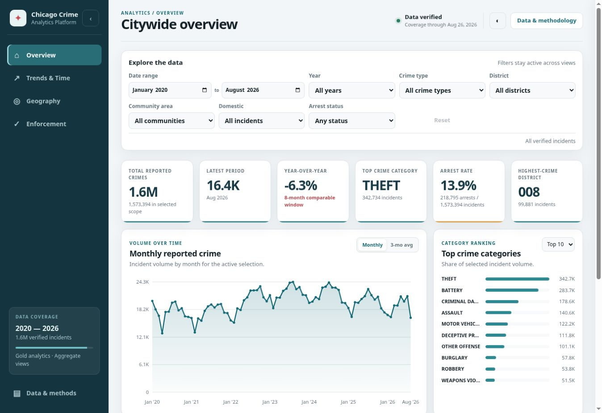
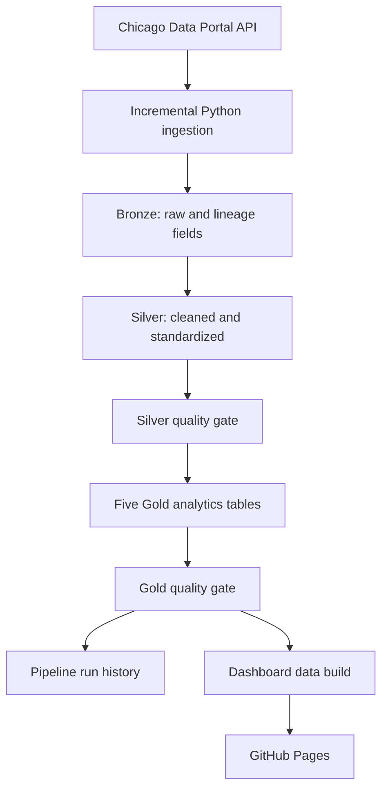

# Chicago Crime Data Pipeline

[](https://github.com/Pranjal677504/chicago_crimes_data_pipeline/actions/workflows/daily_pipeline.yml)

**[Open the live analytics dashboard](https://pranjal677504.github.io/chicago_crimes_data_pipeline/)**

An end-to-end data engineering project that incrementally ingests Chicago crime records, models them through a Bronze–Silver–Gold architecture in MotherDuck, validates every layer with automated quality gates, records operational history, and publishes a refreshed analytics dashboard.



## At a glance

| Capability | Implementation |
| --- | --- |
| Scale | 1.57M+ unique crime records from 2020 onward |
| Ingestion | Incremental Chicago Data Portal API extraction with watermark overlap |
| Modeling | Bronze, Silver, and five purpose-built Gold tables |
| Reliability | Idempotent merge logic, transactional transforms, and automated quality gates |
| Operations | Run IDs, batch lineage, watermarks, row metrics, and failure history |
| Delivery | Daily GitHub Actions workflow and aggregate-only GitHub Pages dashboard |

## Engineering highlights

- Captures late source corrections with an overlap window while preserving idempotency.
- Deduplicates API batches by source ID before merging them into Bronze.
- Rebuilds Silver and Gold inside a transaction and rolls back on failure.
- Blocks dashboard publication unless the pipeline and reconciliation checks succeed.
- Keeps MotherDuck credentials in GitHub Actions secrets and publishes no incident-level rows.

## Architecture



## Technology

- Python for API extraction and orchestration
- SQL for transformations and quality gates
- DuckDB and MotherDuck for analytical storage and execution
- GitHub Actions for daily scheduling
- GitHub Pages for the automatically refreshed dashboard
- Chicago Data Portal SODA API as the source

## Data model

| Layer | Table | Purpose or grain |
| --- | --- | --- |
| Bronze | `bronze_crimes` | Source-shaped records plus ingestion lineage |
| Silver | `silver_crimes` | One cleaned row per `crime_id` |
| Gold | `gold_monthly_crime_trends` | Year, month, crime type |
| Gold | `gold_area_crime_summary` | Year, district |
| Gold | `gold_arrest_analysis` | Year, crime type, domestic flag |
| Gold | `gold_time_patterns` | ISO weekday and hour |
| Gold | `gold_crime_hotspots` | 0.001-degree latitude/longitude bins |

## Incremental design

The runner reads the greatest `updated_on` value already present in Bronze, subtracts a configurable overlap window, and requests records changed since that watermark. The overlap captures late corrections. A staging table is deduplicated by `id`, then merged into Bronze so repeated runs are idempotent.

Every run receives a UUID and batch ID. Success and failure metrics are written to `pipeline_run_history`.

## Repository structure

```text
.
├── .github/workflows/daily_pipeline.yml
├── dashboard/static/
│   ├── index.html
│   ├── styles.css
│   └── app.js
├── src/
│   ├── pipeline.py
│   └── build_dashboard.py
├── docs/
│   ├── architecture.md
│   ├── data_dictionary.md
│   └── operations.md
├── sql/
│   ├── 01_silver_transform.sql
│   ├── 02_silver_quality.sql
│   ├── gold/
│   │   ├── 01_gold_monthly_crime_trends.sql
│   │   ├── 02_gold_area_crime_summary.sql
│   │   ├── 03_gold_arrest_analysis.sql
│   │   ├── 04_gold_time_patterns.sql
│   │   └── 05_gold_crime_hotspots.sql
│   ├── 04_gold_quality.sql
│   └── 05_monitoring.sql
├── .env.example
├── .gitignore
├── requirements.txt
└── README.md
```

## Documentation

- [Pipeline architecture](docs/architecture.md)
- [Data dictionary](docs/data_dictionary.md)
- [Operations guide](docs/operations.md)

## Run locally

### Prerequisites

- Python 3.12
- A MotherDuck database containing the historical `bronze_crimes` baseline table
- A MotherDuck access token

The historical bootstrap is intentionally separate from the incremental runner. `src/pipeline.py` processes new and corrected source records after `bronze_crimes` has been initialized.

1. Copy `.env.example` to `.env` and add your token.
2. Install dependencies:

   ```bash
   pip install -r requirements.txt
   ```

3. Load the `.env` variables into your shell, then run:

   ```bash
   python src/pipeline.py
   ```

Never commit `.env` or a MotherDuck token.

## Automation and deployment

The workflow runs daily at `01:30 UTC` (`07:00 IST`) and can also be started manually. It loads incremental API changes, rebuilds the analytical layers, executes the quality gates, generates aggregate dashboard data, and deploys to GitHub Pages.

Generated JSON is packaged as an ephemeral Pages artifact rather than committed to repository history. If any pipeline or reconciliation check fails, deployment stops and the last verified dashboard remains online. Setup and recovery procedures are documented in the [operations guide](docs/operations.md).

## Quality controls

- Bronze-to-Silver row reconciliation
- Unique `crime_id`
- Required-field and date/year validation
- Coordinate-pair consistency and correction of two known invalid coordinate records
- Geographic-code formatting
- Gold grain uniqueness, null, measure, domain, and source-total reconciliation
- Five Gold tables must pass before the run is marked successful

## Source

Data is provided by the City of Chicago's **Crimes — 2001 to Present** dataset. This project intentionally limits analytical records to 2020 onward.

## License

No open-source license has been granted. The repository is publicly viewable, but reuse, redistribution, and modification are not automatically permitted.
