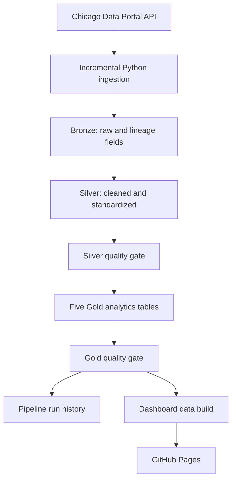

# Chicago Crimes Data Pipeline

[](https://github.com/Pranjal677504/chicago_crimes_data_pipeline/actions/workflows/daily_pipeline.yml)

[Open the interactive dashboard](https://pranjal677504.github.io/chicago_crimes_data_pipeline/)

An end-to-end data engineering project that incrementally ingests Chicago crime records, models them in a Bronze–Silver–Gold architecture in MotherDuck, validates every layer with automated quality gates, records operational run history, and publishes an interactive analytics dashboard.

## Architecture



## Technology

- Python for API extraction and orchestration
- SQL for transformations and quality gates
- DuckDB and MotherDuck for analytical storage and execution
- GitHub Actions for daily scheduling
- GitHub Pages for the automatically refreshed dashboard
- Chicago Data Portal SODA API as the source

## Data model

| Layer | Table | Purpose or grain |
| --- | --- | --- |
| Bronze | `bronze_crimes` | Source-shaped records plus ingestion lineage |
| Silver | `silver_crimes` | One cleaned row per `crime_id` |
| Gold | `gold_monthly_crime_trends` | Year, month, crime type |
| Gold | `gold_area_crime_summary` | Year, district |
| Gold | `gold_arrest_analysis` | Year, crime type, domestic flag |
| Gold | `gold_time_patterns` | ISO weekday and hour |
| Gold | `gold_crime_hotspots` | 0.001-degree latitude/longitude bins |

## Incremental design

The runner reads the greatest `updated_on` value already present in Bronze, subtracts a configurable overlap window, and requests records changed since that watermark. The overlap captures late corrections. A staging table is deduplicated by `id`, then merged into Bronze so repeated runs are idempotent.

Every run receives a UUID and batch ID. Success and failure metrics are written to `pipeline_run_history`.

## Repository structure

```text
.
├── .github/workflows/daily_pipeline.yml
├── dashboard/static/
│   ├── index.html
│   ├── styles.css
│   └── app.js
├── src/
│   ├── pipeline.py
│   └── build_dashboard.py
├── docs/
│   ├── architecture.md
│   ├── data_dictionary.md
│   └── operations.md
├── sql/
│   ├── 01_silver_transform.sql
│   ├── 02_silver_quality.sql
│   ├── gold/
│   │   ├── 01_gold_monthly_crime_trends.sql
│   │   ├── 02_gold_area_crime_summary.sql
│   │   ├── 03_gold_arrest_analysis.sql
│   │   ├── 04_gold_time_patterns.sql
│   │   └── 05_gold_crime_hotspots.sql
│   ├── 04_gold_quality.sql
│   └── 05_monitoring.sql
├── .env.example
├── .gitignore
├── requirements.txt
└── README.md
```

## Documentation

- [Pipeline architecture](docs/architecture.md)
- [Data dictionary](docs/data_dictionary.md)
- [Operations guide](docs/operations.md)

## Run locally

1. Create a MotherDuck token.
2. Copy `.env.example` to `.env` and place the token there.
3. Install dependencies:

   ```bash
   pip install -r requirements.txt
   ```

4. Export the variables from `.env`, then run:

   ```bash
   python src/pipeline.py
   ```

Never commit `.env` or a MotherDuck token.

## GitHub Actions setup

Add `MOTHERDUCK_TOKEN` under **Settings → Secrets and variables → Actions**. `CHICAGO_APP_TOKEN` is optional but recommended for steadier API limits. Run the workflow manually once before relying on the daily schedule.

The schedule is `01:30 UTC`, equivalent to `07:00 IST`. Scheduled GitHub Actions may start a few minutes late during periods of high demand.

## Automated dashboard

After the incremental load and all quality gates pass, the same workflow builds a static dashboard directly from the validated MotherDuck tables and deploys it to GitHub Pages. A failed pipeline or reconciliation check prevents publication, so the live dashboard remains on the last verified version.

Enable **Settings → Pages → Build and deployment → GitHub Actions** once for the repository. No data files are committed: the workflow creates an ephemeral Pages artifact, which avoids repository bloat while keeping `MOTHERDUCK_TOKEN` in Actions secrets.

To validate the dashboard build locally with the project Parquet exports:

```bash
python src/build_dashboard.py --parquet-dir /path/to/parquet/files --output /tmp/chicago-dashboard/data
```

## Quality controls

- Bronze-to-Silver row reconciliation
- Unique `crime_id`
- Required-field and date/year validation
- Coordinate-pair consistency and correction of two known invalid coordinate records
- Geographic-code formatting
- Gold grain uniqueness, null, measure, domain, and source-total reconciliation
- Five Gold tables must pass before the run is marked successful

## Source

Data is provided by the City of Chicago's **Crimes — 2001 to Present** dataset. This project intentionally limits analytical records to 2020 onward.

## License

No open-source license has been granted. The repository is publicly viewable, but reuse, redistribution, and modification are not automatically permitted.
