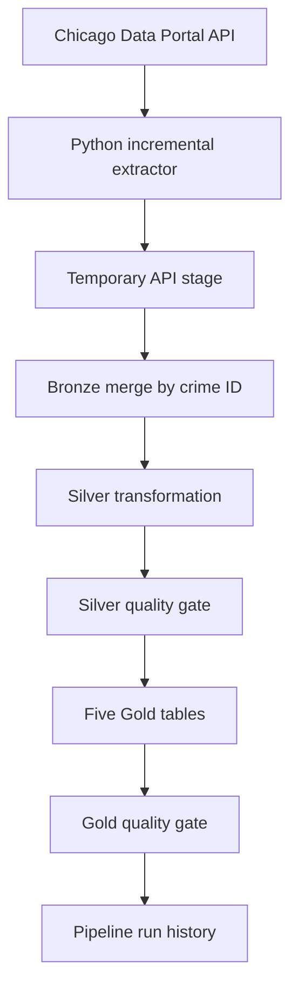

# Pipeline Architecture

## Data flow

## Incremental ingestion

The pipeline obtains the greatest `updated_on` timestamp in `bronze_crimes` and subtracts the configured overlap window. It requests records changed since that timestamp from the Chicago Data Portal, pages through the response, and deduplicates the stage by `id` while retaining the latest version.

The staged batch is merged into Bronze:

- New `id` values are inserted.
- Existing `id` values are updated when the staged `updated_on` value is at least as recent.
- Reprocessing an overlapping interval is safe because records are merged by their stable identifier.

## Layer responsibilities

### Bronze

Bronze preserves the source-shaped fields and adds:

- `ingested_at`
- `source_file`
- `batch_id`

### Silver

Silver standardizes types and geographic codes, renames `id` to `crime_id`, removes the redundant combined `location` field, and nullifies coordinates for the two known invalid records.

### Gold

Gold contains five purpose-built aggregate tables for trends, geographic comparison, arrests, time patterns, and coordinate hotspots.

## Failure behavior

Silver and Gold construction run inside a transaction. A failed quality gate raises an error and rolls back the transformations. The runner then records the failed run and its error message in `pipeline_run_history`.

